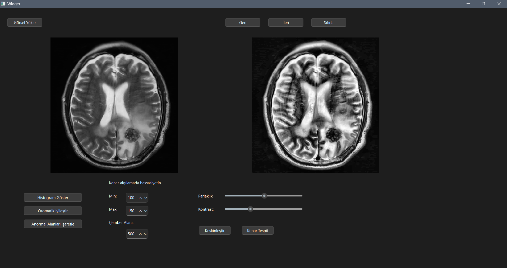
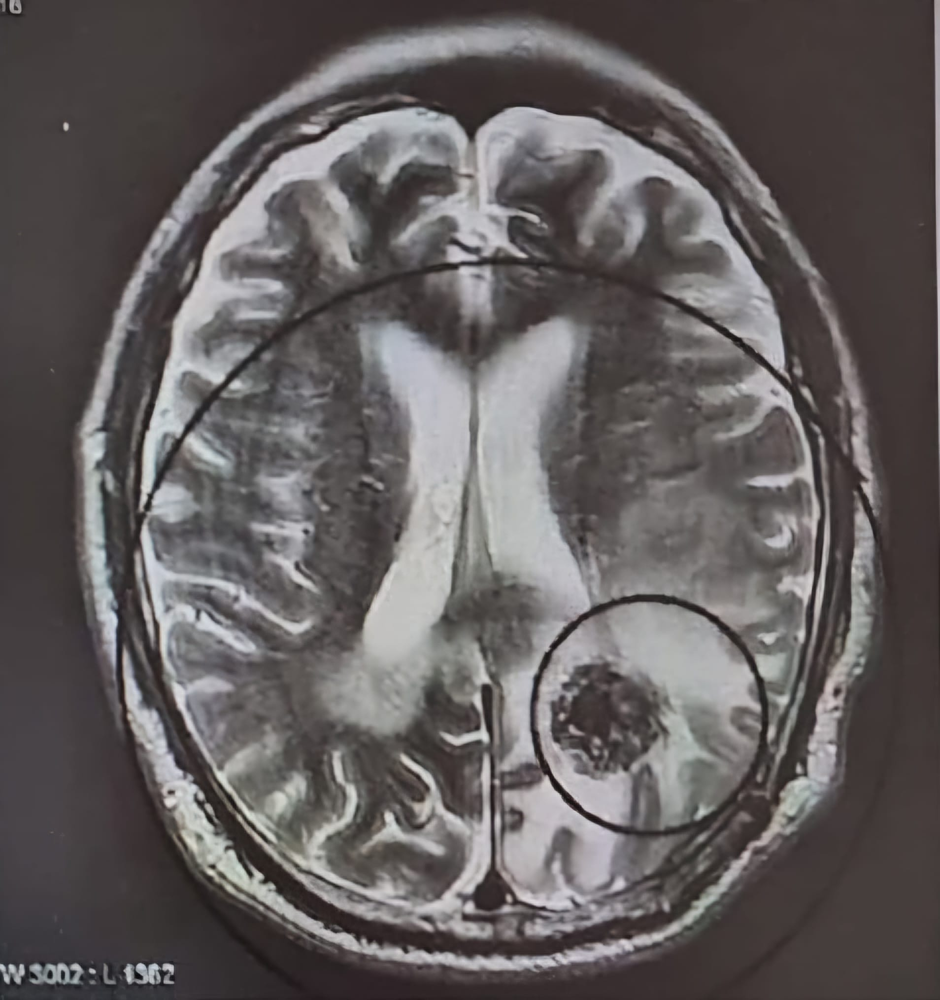
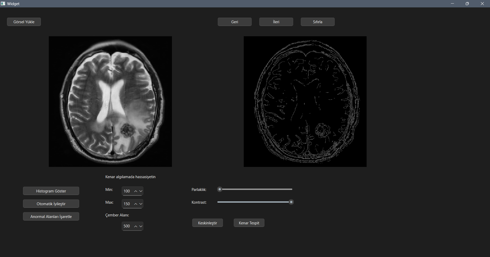
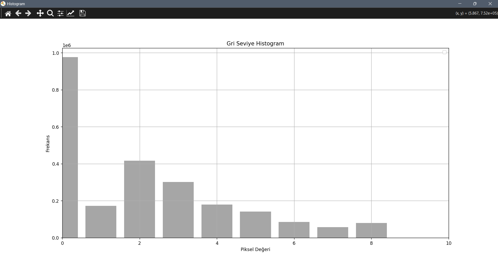

# Medical Image Enhancement GUI with PySide6 and OpenCV

## Description
This is a desktop application built with PySide6 and OpenCV for performing basic medical image processing tasks. It allows users to load grayscale medical images (e.g., MRI or X-ray), apply various enhancement techniques, detect edges, highlight abnormal regions, and visualize histograms.

## Features
- Image Loading: Load images in common formats (.png, .jpg, .jpeg, .bmp).
- Brightness and Contrast Adjustment: Real-time control via sliders.
- Edge Detection: Use the Canny algorithm with adjustable thresholds.
- Sharpening: Enhance image clarity with a predefined sharpening filter.
- CLAHE (Contrast Limited Adaptive Histogram Equalization): Improve local contrast.
- Highlight Abnormalities:
  - Detect contours in edge images.
  - Highlight abnormal regions with red circles based on area threshold.
- Histogram Analysis:
  - Show grayscale histogram.
  - Warn if histogram indicates abnormal distribution (too dark or too bright areas).
- Undo/Redo System: Navigate through processing history (up to 20 steps).
- Reset: Return to the original loaded image.

## Installation
1. Install Python 3.9 or later.

2. Clone this repository:
bash
git clone https://github.com/sudem2302/Medical-Image-Processing.git

3. Navigate to the project directory:
bash
cd Medical-Image-Processing

4. Install the required dependencies:
bash
pip install PySide6 opencv-python numpy matplotlib

5. (If using a .ui file from Qt Designer) Convert it to a Python file:
bash
pyside6-uic form.ui -o ui_form.py

## Usage
1. Run the application:
bash
python main.py

2. Use the interface to:
- Load an image
- Adjust brightness/contrast
- Apply edge detection or CLAHE
- Highlight abnormalities
- View image histograms

## GUI Elements
- Original Image View
- Processed Image View
- Buttons:
  - Load, Reset, Undo, Redo
  - Apply CLAHE, Sharpening, Edge Detection, Highlight Abnormalities
  - Show Histogram
- Sliders: Brightness and Contrast
- Spin Boxes: Canny thresholds and area threshold for abnormality detection

## Dependencies
- PySide6
- OpenCV
- NumPy
- Matplotlib

## Screenshots

### Main Window

### Circle Detection

### Precise Edge Detection

### Histogram

